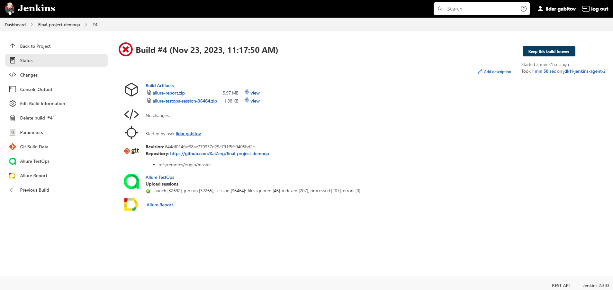

# Проект автоматизации тестирования для [DemoQA](https://demoqa.com)

<p align="center">

</p>

> DemoQA - это демонстрационный сайт для QA-инженеров, изучающих selenium.\
> Создан Tools QA.\
> Состоит из веб-сайта с обучающими формами и примера книжного магазина с открытым API.

# <a name="TableOfContents">Содержание</a>

+ [Описание](#Description)
+ [Инструменты и технологии](#Technology)
+ [Как запустить](#Jenkins)
    + [Команды Gradle](#GradleCommand)
    + [Файлы свойств](#PropertyFiles)
    + [Запуск в Jenkins](#RunInJenkins)
+ [Уведомления в Telegram](#TelegramNotifications)
+ [Отчет о результатах тестирования в Allure Report](#AllureReport)
+ [Интеграция с Allure TestOps](#AllureTestOps)
    + [Проект в Allure TestOps](#AllureTestOpsProject)
    + [Запускаем пользовательский набор тестов](#AllureTestOpsStartTests)
    + [Дашборд](#Dashboard)
    + [Дефекты](#Defects)
+ [Видео с запущенными тестами](#Video)

# <a name="Description">Описание</a>

Дипломный проект состоит из веб-тестов и тестов API.\
Краткий список интересных фактов о проекте:

- [x] `Page Object` и steps с использованием `Chain of Invocations`
- [x] Генерация тестовых данных с помощью библиотеки `Faker`
- [x] Параметризованные тесты
- [x] Параметризованная сборка
- [x] Различные файлы конфигурации для выполнения теста в зависимости от параметров сборки
- [x] Конфигурация с библиотекой `Owner`
- [x] Использование `Lombok` для моделей в тестах API
- [x] Сериализация / десериализация объектов для запросов / ответов API с использованием `Jackson`
- [x] Использование спецификаций запросов / ответов для тестов API
- [x] Пользовательский Allure listener для красивого логирования запросов / ответов API
- [x] `Allure TestOps` интеграция
- [x] Автотесты как тестовая документация
- [x] Параллельное выполнение
- [x] Ретраи упавших тестов

# <a name="Technology">Инструменты и технологии</a>

<p align="center">
  <code><a href="https://www.jetbrains.com/idea/"></a></code>
  <code><a href="https://www.java.com/"></a></code>
  <code><a href="https://selenide.org/"></a></code>
  <code><a href="https://rest-assured.io/"></a></code>
  <code><a href="https://aerokube.com/selenoid/"></a></code>
  <code><a href="https://gradle.org/"></a></code>
  <code><a href="https://junit.org/junit5/"></a></code>
  <code><a href="https://github.com/allure-framework"></a></code>
  <code><a href="https://qameta.io/"></a></code>
  <code><a href="https://github.com/"></a></code>
  <code><a href="https://www.jenkins.io/"></a></code>
  <code><a href="https://web.telegram.org/"></a></code>
</p>

Автотесты в этом проекте написаны на `Java` с использованием `Selenide` фреймворка.\
`Gradle` - используется в качестве инструмента автоматизации сборки.  \
`JUnit5` - для выполнения тестов.\
`REST Assured` - для упрощения тестирования API сервисов REST.\
`Jenkins` - CI/CD для удаленного запуска тестов.\
`Selenoid` - для удаленного запуска браузеров в `Docker` контейнерах.\
`Allure Report` - для визуализации результатов тестирования.\
`Telegram Bot` - для уведомлений о результатах тестирования.\
`Allure TestOps` - как система управления тестированием.

[Назад к содержанию ⬆](#TableOfContents)

# <a name="HowToRun">Как запустить</a>

## <a name="GradleCommand">Команды Gradle</a>

Для локального запуска может быть использована следующая команда:

```bash
gradle clean test
```

Дополнительные параметры:
> `-Dthreads=<number_of_threads>` может быть добавлен для параллельного выполнения тестов\
> `-Denv=remote` может быть добавлен для выполнения удаленных тестов.

`-Dtag=<tag>` - тесты с этим тегом будут выполняться:
>- *api*
>- *ui*

Дополнительные свойства извлекаются из соответствующих файлов свойств:

```bash
./resources/config/${value}.properties
```

[Назад к содержанию ⬆](#TableOfContents)

## <a name="PropertyFiles">Файлы свойств</a>

Возможные свойства в `${env}.properties` файле, локальном или удаленном:

```properties
browserName=
browserVersion=
browserSize=
baseURL=
isRemote=
remoteURL=
```

>- *browserName* - браузер для веб-тестов, поддерживается CHROME и FIREFOX
>- *browserVersion* - версия браузера для веб-тестов
>- *browserSize* - размер браузера для веб-тестов
>- *baseUrl* - базовый URL для веб-тестов
>- *isRemote* - определяет локальные или удаленные среды
>- *remoteURL* - URL для удаленного WebDriver

Возможные свойства `user.properties` файла:

```properties
username=
password=
```

>- *username* - для авторизации старого пользователя, у которого в профиле добавлен Git Pocket Guide book
>- *password* - используется для всех пользователей в тестах

[Назад к содержанию ⬆](#TableOfContents)

## <a name="RunInJenkins">Запуск в [Jenkins](https://jenkins.autotests.cloud/job/Final-project-demoqa/)</a>

Главная страница сборки:
<p align="center">

</p>

Параметризованная джоба Jenkins может быть запущена с необходимыми ***параметрами***:
<p align="center">

</p>

Конфиденциальные конфигурационные файлы создаются в рабочей области сборки при запуске сборки.\
Относительно безопасная информация передается в сборку с помощью аргументов gradle (см. раздел [Команды Gradle](#GradleCommand)
, "Дополнительные параметры").

После завершения сборки результаты тестирования доступны в:
>- <code><strong>*Allure Report*</strong></code>
>- <code><strong>*Allure TestOps*</strong></code> - результаты загружаются туда, и автоматизированные тестовые примеры могут автоматически обновляться в соответствии с последними изменениями в коде.
<p align="center">

</p>

[Назад к содержанию ⬆](#TableOfContents)

# <a name="TelegramNotifications">Уведомления в Telegram</a>

Telegram-бот отправляет краткий отчет в указанный telegram-чат по результатам каждой сборки.
<p align="center">

</p>

[Назад к содержанию ⬆](#TableOfContents)

# <a name="AllureReport">Отчет о результатах тестирования в [Allure Report](https://jenkins.autotests.cloud/job/Final-project-demoqa/2/allure/#)</a>

## Главная страница

Главная страница Allure report содержит следующие блоки:

>- <code><strong>*ALLURE REPORT*</strong></code> - отображает дату и время тестирования, общее количество запущенных тестов и диаграмму с процентом и количеством пройденных, неудачных или неработающих тестов
>- <code><strong>*TREND*</strong></code> - отображает тенденцию выполнения тестов для всех запусков
>- <code><strong>*SUITES*</strong></code> - отображает распределение тестов по наборам
>- <code><strong>*CATEGORIES*</strong></code> - отображает распределение неудачных тестов по типам дефектов
<p align="center">
  
</p>

## Список тестов с шагами и тестовыми артефактами

На странице представлен список тестов, сгруппированных по наборам, со статусом, показанным для каждого теста.\
Может быть показана полная информация о каждом тесте: теги, серьезность, продолжительность, подробные шаги.

Также доступны дополнительные тестовые артефакты:
>- Screenshot
>- Page Source
>- Browser console log
>- Video

<p align="center">
  
</p>

<p align="left">
  
</p>

[Назад к содержанию ⬆](#TableOfContents)

# <a name="AllureTestOps">Интеграция с [Allure TestOps](https://allure.autotests.cloud/project/1810/dashboards)</a>

## <a name="AllureTestOpsProject">Проект в Allure TestOps</a>

Тест-кейсы в проект импортируются и постоянно обновляются из кода, поэтому нет необходимости в сложном процессе синхронизации ручных тест-кейсов и автотестов.\
Достаточно создать и обновить автотест в коде, и тестовый пример в TMS всегда будет в актуальном состоянии.\
Ручные тест-кейсы также могут быть добавлены в TMS в случае необходимости (через веб-интерфейс или с помощью кода).
<p align="center">
  
</p>

## <a name="AllureTestOpsStartTests">Возможность запуска пользовательского набора тестов из Allure TestOps</a>

Любой человек, не имеющий отношения к созданию автотестов, может выбрать набор тестов, параметры среды и запустить запуск.\
Будет создан Allure TestOps run, задание Jenkins запущено с правильными параметрами. Результаты джобы будут легко интегрированы в Allure TestOps.
<p align="center">
  
</p>

Как только задание Jenkins будет выполнено, соответствующие тесты получат свои статусы. Тестировщик может завершить ручные тесты (если таковые имеются) и нажать "Close launch".

<p align="center">
  
</p>

> После этого все эти тест кейсы (имена, шаги, теги и т.д.) Будут обновлены в соответствии с последними изменениями кода.

[Назад к содержанию ⬆](#TableOfContents)

## <a name="Dashboard">Дашборд</a>

Графики тенденций автоматизации, тесты распространения по некоторым различным параметрам и т.д.:
<p align="center">
  
</p>

[Назад к содержанию ⬆](#TableOfContents)

## <a name="Defects">Дефекты</a>

Знает, что дефекты автоматически распознаются по определенным шаблонам для сбоев теста при дальнейших запусках.
<p align="center">
  
</p>

[Назад к содержанию ⬆](#TableOfContents)

# <a name="Video">Видео с запущенными тестами</a>

<p align="center">
  
</p>

<p align="center">
  
</p>

[Назад к содержанию ⬆](#TableOfContents)
